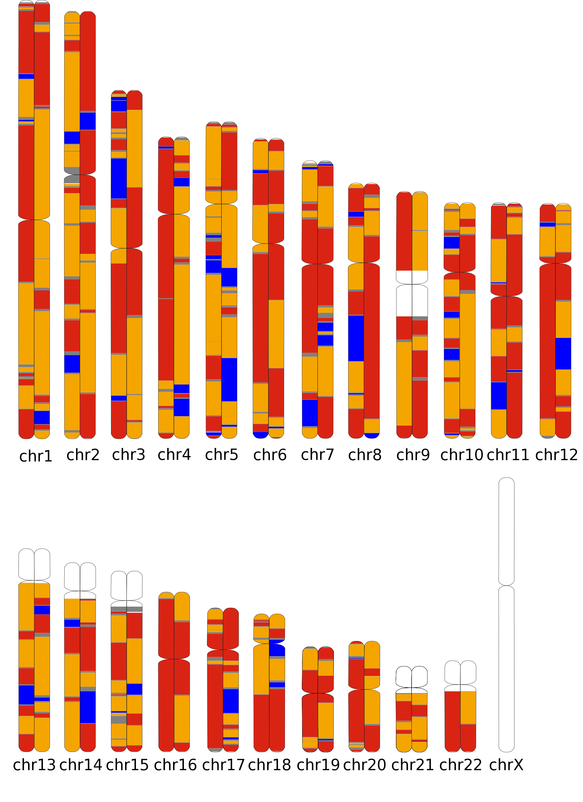

   * [daVinci](#davinci)
      * [Installation](#installation)
         * [Requirements](#requirements)
         * [Conversion script Python dependency](#conversion-script-python-dependency)
      * [Quick start](#quick-start)
      * [Usage](#usage)
      * [Input file description](#input-file-description)

# daVinci

`daVinci` is a simple way to visualize features on human chromosome ideograms as shown in this article: https://www.nature.com/articles/srep12376

`daVinci` was designed to allow everyone to create 23AndMe style chromosome painting diagrams.



## Installation

`daVinci` is a simple Python script that uses the RSVG library and has no other depenendies.

### Requirements
* Python 3.6+
* [RSVG](https://developer.gnome.org/rsvg/stable/)

### Conversion script Python dependency
* [Click](https://click.palletsprojects.com/en/7.x/)

```bash
 pip install click
 ```

## Quick start
```bash
./daVinci.py --input example_ideogram/test.bed --prefix example_ideogram/example
```

## Usage
```
usage: daVinci.py [-h] [--version] -i <input.bed> [-p [output file prefix]] [-v] [-f]

daVinci: a utility for illustrating human chromosomes

optional arguments:
  -h, --help                                              show this help message and exit
  --version                                               Print the software version.
  -i <input.bed>, --input <input.bed>                     Input BED-like file
  -p [output file prefix], --prefix [output file prefix]  Output prefix [Default: "out"]
  -v, --verbose                                           Display verbose output
  -f, --force                                             Overwrite output files if they exist already

```
The input file is a bed-like format, described below.  If an output prefix is not specified, the scripts uses "out" as the default prefix.

Helper scripts for converting RFmix and ADMIXTURE outputs are included in the `scripts/` folder.

There is a more complete example of a full chromosome painting using RFmix output can be seen by running:

```bash
./scripts/rfmix2davinci.py --chr1 example_ideogram/1KGP-MXL104_chr1.bed \
	--chr2 example_ideogram/1KGP-MXL104_chr2.bed \
	--out example_ideogram/1KGP-MXL104_davinci.bed

./daVinci.py -input example_ideogram/1KGP-MXL104_davinci.bed \
	--prefix example_ideogram/1KGP-MXL104

```

## Input file description
```
#chr	start	stop	feature	size	color	chrCopy
chr1	10000000	20000000	0	1	#FF0000	1
chr2	20000000	30000000	0	1	#FF0000	2
chr2	40000000	50000000	0	0.5	#FF0000	1
```

Each column is explained below:
1. *chr* - The chromosome on which a feature has to be drawn
2. *start* - Start position (in bp) for feature
3. *stop* - Stop position (in bp) for feature
4. *feature* - The shape of the feature to be drawn
	* 0 will draw a rectangle
	* 1 will draw a circle
	* 2 will draw a triangle pointing to the genomic location
	* 3 will draw a line at that genomic location
5. *size* - The horizontal size of the feature. Should range between 0 and 1.
6. *color* - Specify the color of the genomic feature with a hex value (#FF0000 for red, etc.)
7. *chrCopy* - Specify the chromosome copy on which the feature should be drawn (1 or 2).  To draw the same feature on both chromosomes, you must specify the feature twice
